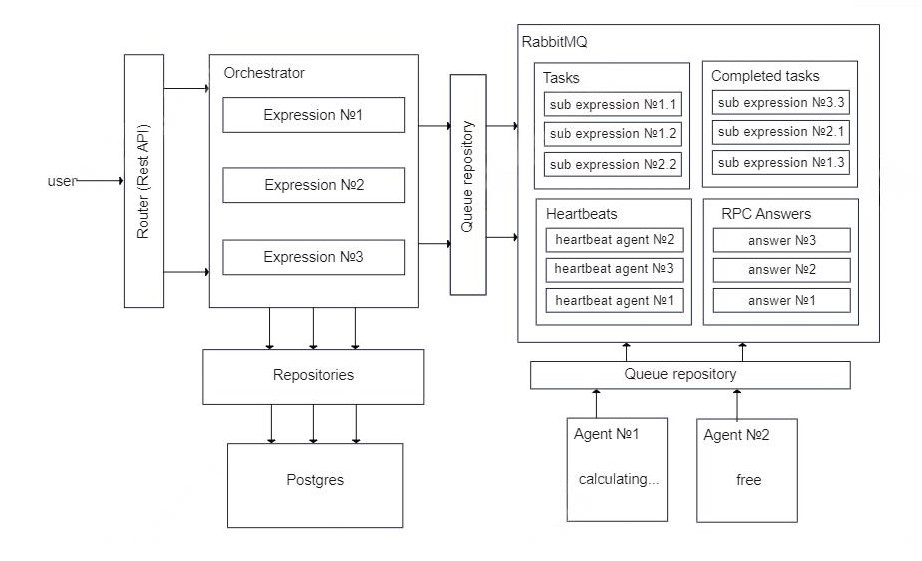
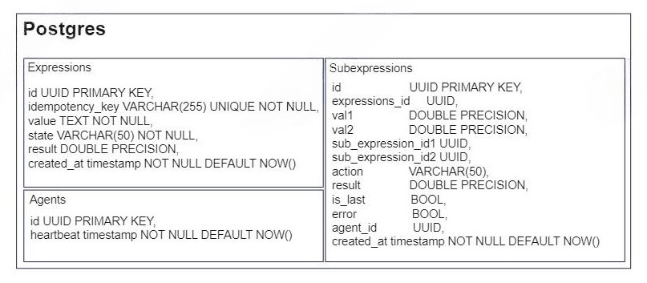

# Проект по второму спринту от курса Яндекса Лицея "Разработка на языке Golang"

## _ПО ЛЮБЫМ ВОПРОСАМ ПИШИ МНЕ В ТЕЛЕГРАМ: [@Badimonchik](https://t.me/Badimonchik)_

## Запуск проекта (в корневом каталоге)

1. установить [Make](https://thelinuxcode.com/install-use-make-windows/) (
   опционально), [docker engine](https://docs.docker.com/engine/install/), [docker-compose](https://docs.docker.com/compose/install/)
2. с помощью MakeFile: make build AGENT=3   
   с помощью docker-compose: docker-compose up --scale agent=3 -d --no-recreate --build  
   (вместо трех можно подставить любое число - столько агентов запустится)
3. ждем пару минут (зависит от компьютера и интернет-соединения) пока не запустятся все компоненты системы
## Запросы

* Быстрый импорт запросов с помощью [Postman](docs/Project.postman_collection.json)

1. POST http://localhost:8080/expression - создает expression  
   *_обязательно должен быть ключ идемпотентности в Header (X-Idempotency-Key) и строка с арифметическим выражением в Body
   form-data (expression)_*
2. GET http://localhost:8080/expression/{expression_id} - возвращает информацию о выражении
3. GET http://localhost:8080/expressions - возвращает список всех выражений
4. GET http://localhost:8080/agents - возвращает список агентов

## Примеры запросов

1. 2+2*2 (_обрати внимание на ключ идемпотентности X-Idempotency-Key, он должен отличаться для каждого примера_)

``` 
  curl --location 'http://localhost:8080/expression' \
  --header 'X-Idempotency-Key: 1' \
  --form 'expression="2+2*2"'
  ```

```
a1fd5749-9855-4949-8129-c52bcebbba4f
```

после того, как выражение посчитается

``` 
curl --location 'http://localhost:8080/expression/a1fd5749-9855-4949-8129-c52bcebbba4f'
  ```

```json
{
  "result": 6,
  "id": "a1fd5749-9855-4949-8129-c52bcebbba4f",
  "idempotencyKey": "1",
  "value": "2+2*2",
  "state": "ok"
}
```

2. 2+(2*2) (_обрати внимание на ключ идемпотентности X-Idempotency-Key, он должен отличаться для каждого примера_)

``` 
curl --location 'http://localhost:8080/expression' \
--header 'X-Idempotency-Key: 2' \
--form 'expression="2+(2*2)"'
  ```

```
ad0e375d-0788-4eba-b120-124a4e8b28b7
```

после того, как выражение посчитается

``` 
curl --location 'http://localhost:8080/expression/ad0e375d-0788-4eba-b120-124a4e8b28b7'
  ```

```json
{
  "result": 8,
  "id": "ad0e375d-0788-4eba-b120-124a4e8b28b7",
  "idempotencyKey": "2",
  "value": "(2+2)*2",
  "state": "ok"
}
```

3. 2+(2*2)) (_обрати внимание на ключ идемпотентности X-Idempotency-Key, он должен отличаться для каждого примера_)

```
curl --location 'http://localhost:8080/expression' \
--header 'X-Idempotency-Key: 3' \
--form 'expression="(2+2)*2))"'
```

```
Invalid expression
```

4. 2+2/0 (_обрати внимание на ключ идемпотентности X-Idempotency-Key, он должен отличаться для каждого примера_)
```
curl --location 'http://localhost:8080/expression' \
--header 'X-Idempotency-Key: 4' \
--form 'expression="2+2/0"'
```

``` 
167935e7-0d86-4f72-991a-079944e3a529
  ```

когда подсчет будет на делении на ноль:
```json
{
 "result": 0,
 "id": "167935e7-0d86-4f72-991a-079944e3a529",
 "idempotencyKey": "4",
 "value": "2+2/0",
 "state": "error"
}
```

## Структура проекта
Мой проект имеет [следующую папочную структуру](https://clck.ru/38tRth)

Пояснение для каждой папки:
* cmd/ - точки входа для оркестратора и агента
* data/ - миграции и данные для хранения postgres
* docs/ - 
* internal/ - неимпортируемые из проекта файлы
  * config/ - конфигурационные файлы 
  * models/ - сущности, с которыми работает проект
  * repositories/ - абстракция над данными ([подробнее про паттерн "Репозиторий"](https://habr.com/ru/articles/248505/))
  * services/ - бизнес логика приложения
* .gitignore - директории и файлы, которые не нужно отслеживать Git
* docker-compose.yml - конфигурация для docker-compose
* Dockerfile - конфигурация для docker
* go.mod - корень управления зависимостями go
* Makefile - содержит быстрые команды для запуска и рестарта проекта
* README.md - инструкция по использованию

## Как работает проект
 


docker-compose поднимает две сущности через точки входа: Оркестратора и Агента  

1. Оркестратор
   * поднимает сервер и принимает запросы по REST API
   * когда поступает запрос POST /expression - валидирует выражение, добавляет его в бд, делит выражение на подвыражения с помощью польской нотации (подробнее), отправляет подвыражения в БД
   * читает очередь RPCAnswers, откуда приходит информация от агента, какое он подвыражение взял. оркестратор добавляет эту информацию в БД
   * читает очередь выполненных подвыражений (completed tasks), обновляет результаты подвыражений в БД. когда приходит последнее подвыражение изначального выражения - обновляет результат в выражении
   * читате очередь heartbeats - если пришел heartbeat от незнакомого агента - добавляет в БД. если heartbeat уже добавленного агента - обновляет время.
   * каждую секунду смотрит на список подвыражений. если агент, который выполняет определенное подвыражение не отвечает больше 40 секунд (смотрим в heartbeat), то пересоздаем подвыражение
2. Триггер Postgres (подробнее про тригеры)
   * если в БД поступило новое подвыражение, то отправляет его в очередь подвыражений (SubExpressions)
3. Агент
   * читает очередь подвыражений (subExpressions), считает подвыражение с задержкой из конфига
   * после подсчета подвыражения, отправляет его в очередь посчитанных подвыражений (completed tasks)

## Технологии
1. ЯП Golang
2. Очередь Rabbitmq
3. БД Postgres
## Критерии
___ОЖИДАЕМАЯ ОЦЕНКА 80-90 БАЛЛОВ, ЕСЛИ С ЧЕМ-ТО НЕ СОГЛАСЕН - ПИШИ В ТГ [@Badimonchik](https://t.me/Badimonchik)___  
0. Необходимые требования: - ___ВЫПОЛНЕНО (+10)___
    - Существует Readme документ, в котором описано, как запустить систему и как ей пользоваться.
        -   Это может быть docker-compose, makefile, подробная инструкция - на ваш вкус
    - Если вы предоставляете только http-api, то
        - в Readme описаны примеры запросов с помощью curl-a или любым дргуми понятными образом
        - примеры полны и понятно как их запустить
1. Программа запускается и все примеры с вычислением арифметических выражений корректно работают - ___ВЫПОЛНЕНО (+10)___
2. Программа запускается и выполняются произвольные примеры с вычислением арифметических выражений - ___ВЫПОЛНЕНО (+10)___
3. Можно перезапустить любой компонент системы и система корректно обработает перезапуск (результаты сохранены, система продолжает работать) - ___ВЫПОЛНЕНО___
4. Система предосталяет графический интерфейс для вычисления арифметических выражений - ___НЕ ВЫПОЛНЕНО___
5. Реализован мониторинг воркеров - ___ВЫПОЛНЕНО (+20)___
6. Реализован интерфейс для мориторинга воркеров - ___НЕ ВЫПОЛНЕНО___
7. Вам понятна кодовая база и структура проекта - ___СУБЪЕКТИВНО___
8. У системы есть документация со схемами, которая наглядно отвечает на вопрос: "Как это все работает" - ___ВЫПОЛНЕНО (+10)___
9. Выражение должно иметь возможность выполняться разными агентами - ___ВЫПОЛНЕНО (+10)___