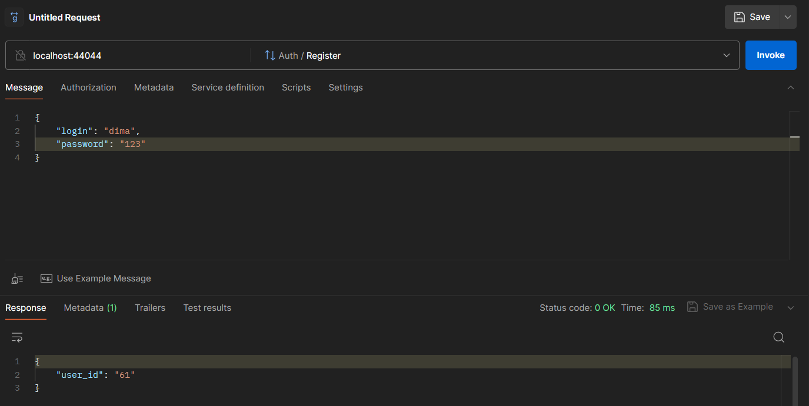
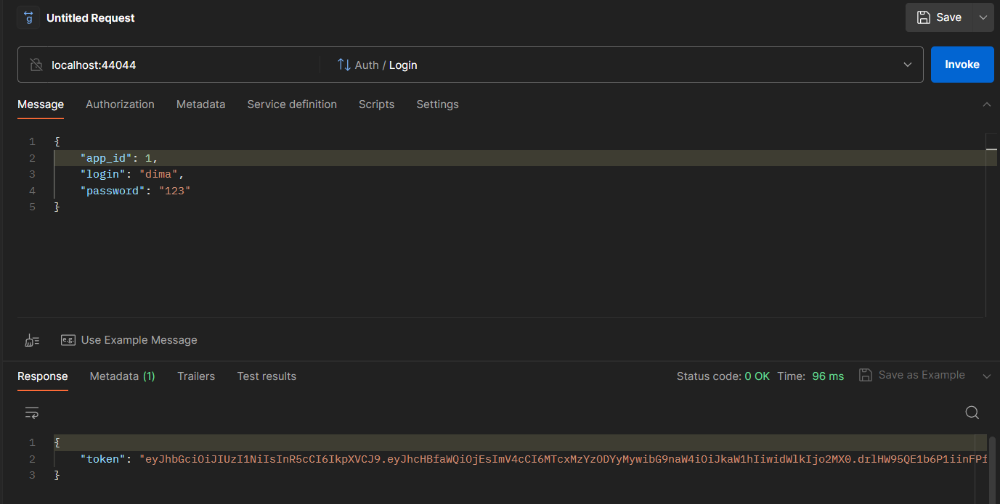
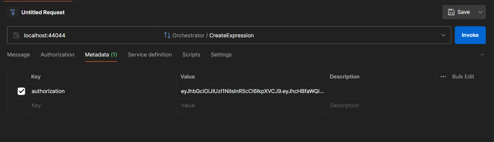
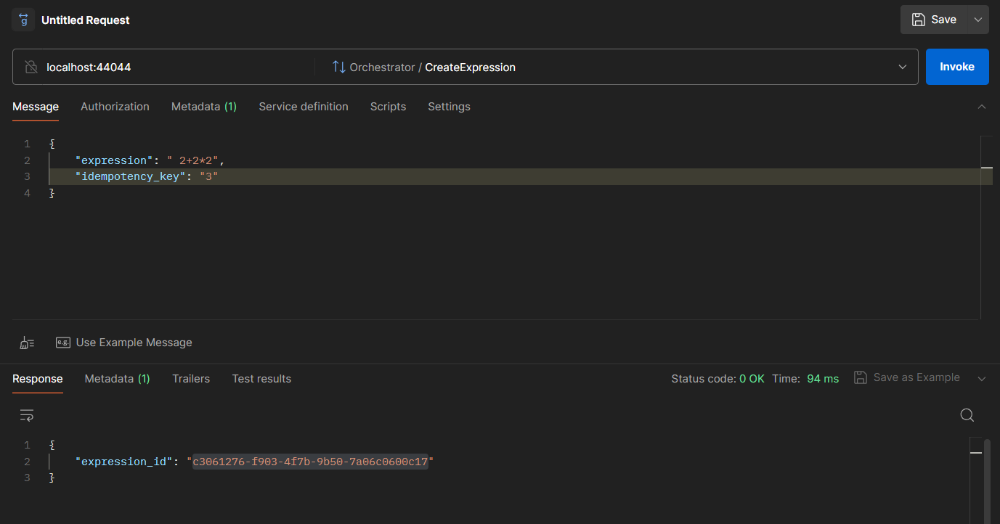
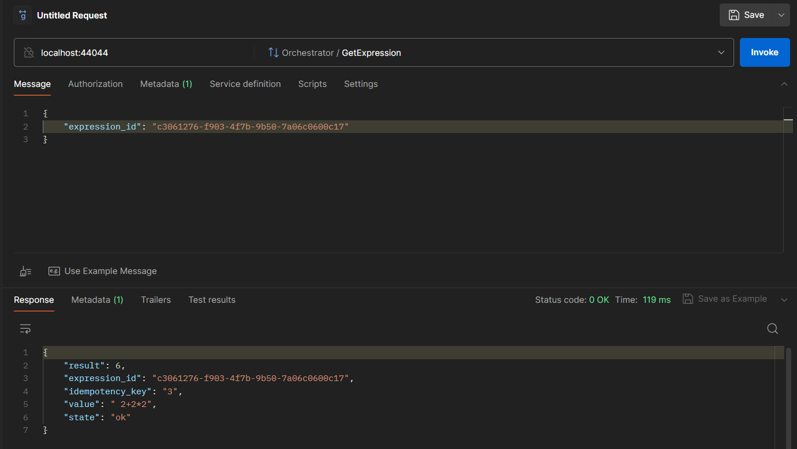
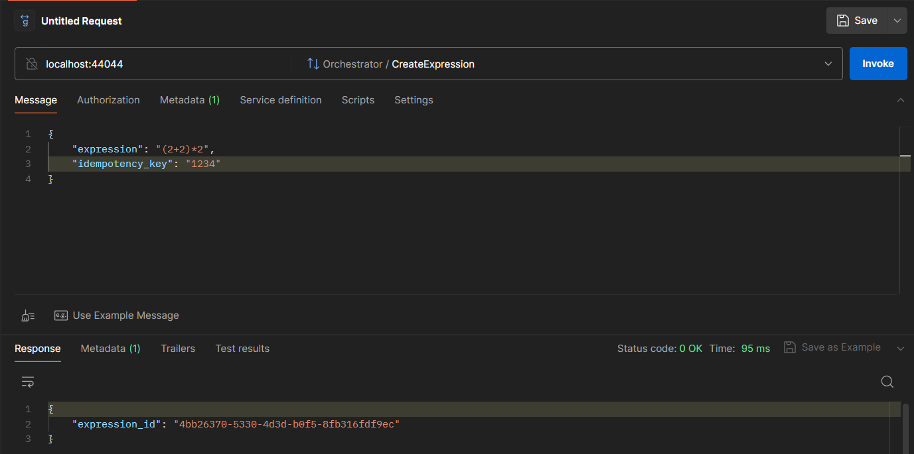
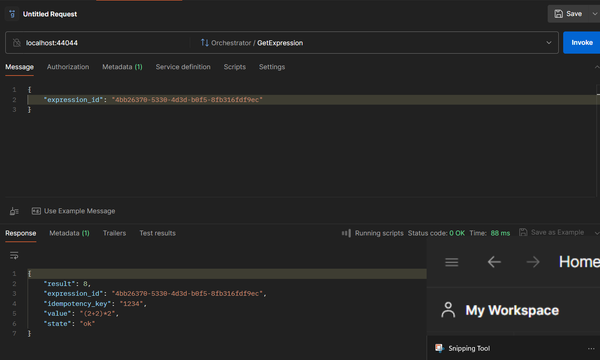
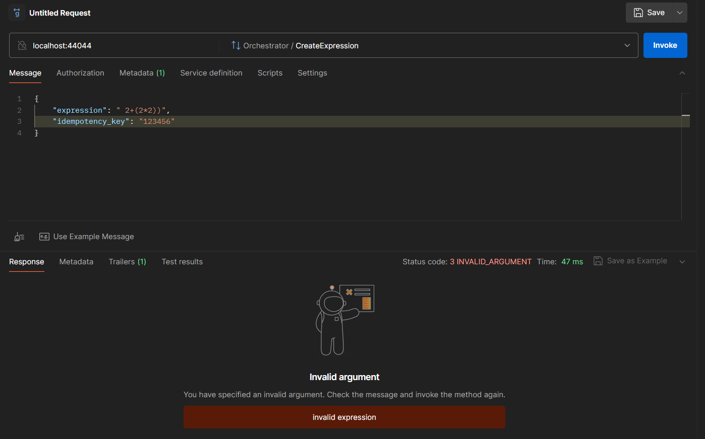
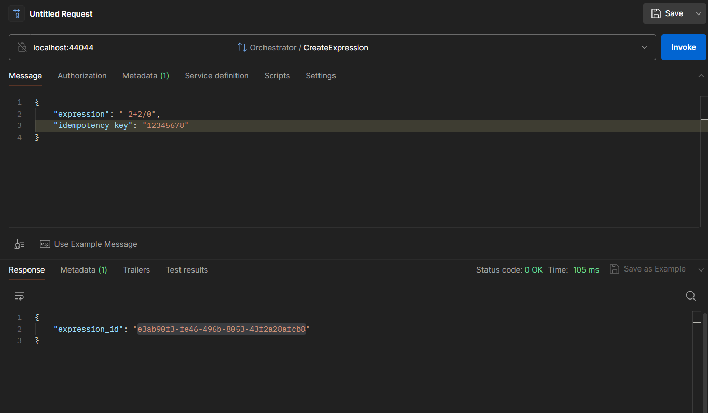
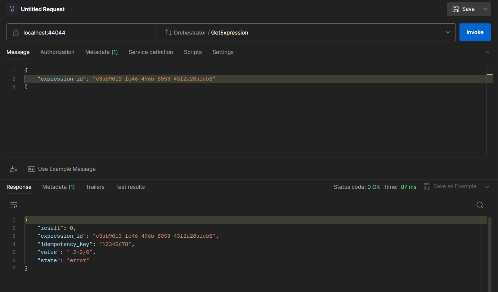

# Проект по третьему спринту от курса Яндекса Лицея "Разработка на языке Golang"

## _ПО ЛЮБЫМ ВОПРОСАМ ПИШИ МНЕ В ТЕЛЕГРАМ: <a href="https://t.me/Badimonchik" target="_blank">@Badimonchik</a>_

### ВНИМАНИЕ, ОБЩЕНИЕ АГЕНТОВ И ОРКЕСТРАТОРА ПРОИСХОДИТ ЧЕРЕЗ БРОКЕР СООБЩЕНИЙ, <i><u>ПОЭТОМУ ОТКРЫТОЕ API НАПИСАНО НА GRPC</u></i>. ЭТО ОБСУЖДАЛОСЬ НА ОДНОЙ ИЗ КОНСУЛЬТАЦИЙ, <u>НЕ СНИЖАЙТЕ ЗА ЭТО БАЛЛЫ!!!</u>
## Запуск проекта (в корневом каталоге)

1. установить [Make](https://thelinuxcode.com/install-use-make-windows/) (
   опционально), [docker engine](https://docs.docker.com/engine/install/), [docker-compose](https://docs.docker.com/compose/install/)
2. с помощью MakeFile: make build AGENT=3   
   с помощью docker-compose: docker-compose up --scale agent=3 --scale postgres-for-test-integration=0 -d --no-recreate --build  
   (вместо трех можно подставить любое число - столько агентов запустится)
3. ждем пару минут (зависит от компьютера и интернет-соединения) пока не запустятся все компоненты системы

## Доступные команды
   * make build (docker-compose up --scale agent=любое_число_агентов --scale postgres-for-test-integration=0 -d --no-recreate --build)
   * make scale любое_число_агентов (docker-compose --scale agent=любое_число_агентов)
   * make rebuild (docker-compose down && docker-compose up --scale agent=любое_число_агентов --scale postgres-for-test-integration=0 -d --no-recreate --build)
   * make down (docker-compose down)
   * make clean (docker-compose down --rmi all --volumes)
   * make up-for-test-integration (docker-compose --env-file .env-test-integration up orchestrator agent rabbitmq postgres-for-test-integration --scale agent=любое_число_агентов --scale postgres=0  -d --no-recreate --build)
## Запросы
### ВНИМАНИЕ, ОБЩЕНИЕ АГЕНТОВ И ОРКЕСТРАТОРА ПРОИСХОДИТ ЧЕРЕЗ БРОКЕР СООБЩЕНИЙ, <i><u>ПОЭТОМУ ОТКРЫТОЕ API НАПИСАНО НА GRPC</u></i>. ЭТО ОБСУЖДАЛОСЬ НА ОДНОЙ ИЗ КОНСУЛЬТАЦИЙ, <u>НЕ СНИЖАЙТЕ ЗА ЭТО БАЛЛЫ!!!</u>

Проверять можно либо через Postman (рекомендуется), либо через grpc_cli
<b>Все примеры будут рассматриваться в Postman, чтобы интегрировать grpc запросы в Postman, <a href='https://habr.com/ru/companies/otus/articles/699616/'>прочитайте эту статью</a></b>

0. Url адрес - localhost:44044
1. auth.Auth Register - регистрирует пользователя
   параметры, передаваемые в message:
   * password 
   * login 
2. auth.Auth Login - возвращает JWT Токен
   параметры, передаваемые в message:
   * app_id (передавайте 1, он символизирует оркестратор)
   * password
   * login 
3. orchestrator.Orchestrator CreateExpression - создает выражение, возвращает expression_id  
   параметры, передаваемые в message:
   * expression
   * idempotency_key  
  <i>обязательно должен быть передан JWT-токен в Metadata (ключ authorization)</i>
4. orchestrator.Orchestrator GetExpression - возвращает информацию о выражении
   параметры, передаваемые в message:
   * expression_id  
     <i>обязательно должен быть передан JWT-токен в Metadata (ключ authorization)</i>
5. orchestrator.Orchestrator GetExpressions - возвращает список всех выражений  
   <i>обязательно должен быть передан JWT-токен в Metadata (ключ authorization)</i>
6. orchestrator.Orchestrator GetAgents - возвращает список всех агентов   
   <i>обязательно должен быть передан JWT-токен в Metadata (ключ authorization)</i>

## Ограничения для выражения
1. Не должно быть инфиксного минуса (например -2+2, только 2-2)
2. В выражении могут присутствовать скобки, числа, операторы +-*/

## Примеры запросов

Проверять можно либо через Postman (рекомендуется), либо через grpc_cli  
<b>Все примеры будут рассматриваться в Postman, чтобы интегрировать grpc запросы в Postman, <a href='https://habr.com/ru/companies/otus/articles/699616/'>прочитайте эту статью</a></b>  

```
PROTO ФАЙЛЫ ПРОЕКТА НАХОДЯТСЯ В ОТДЕЛЬНОМ РЕПОЗИТОРИИ: https://github.com/s0vunia/protos
```

__1. регистрация__ 
 

__2. авторизация (app_id указывайте всегда 1, символизирует сервис оркестратора)__
 

<b><i>ВО ВСЕХ ЗАПРОСАХ К ОРКЕСТРАТОРУ ДАЛЕЕ НУЖНО УКАЗЫВАТЬ JWT-ТОКЕН В METADATA</i></b>
 

__3. 2+2*2 (_обрати внимание на ключ идемпотентности idempotency_key, он должен отличаться для каждого примера_)__
 

после того, как выражение посчитается
 

__2. (2+2)*2 (_обрати внимание на ключ идемпотентности idempotency_key, он должен отличаться для каждого примера_)__
 

после того, как выражение посчитается
 

__3. 2+(2*2)) (_обрати внимание на ключ идемпотентности idempotency_key, он должен отличаться для каждого примера_)__
 

__4. 2+2/0 (_обрати внимание на ключ идемпотентности idempotency_key, он должен отличаться для каждого примера_)__
 

когда подсчет будет на делении на ноль:
 

## Тестовые сценарии (интеграционные тесты) 
В директории /test-integration/ находятся интеграционные тесты
- main_test.go - поднимает окружение проекта. пытается делать тестовый запрос healthcheck, чтобы проверить работоспособность gRPC-сервера. В случае ошибки пытается сделать реконнект. После прогона всех тестов удаляет все созданные контейнеры.
- unauthenticated_test.go - пытается создать выражение без JWT-токена
- authenticated_test.go - прогоняет набор выражений, ждет пока посчитаются, проверяет значения (для интеграционных тестов стоит задержка в 2с на каждую операцию). все это, будучи авторизированным с JWT-токеном
- parallel_calculation.go - проверяет параллельное выполнение выражений (несколько независимых подвыражений в одном выражении)
- access_for_users_test.go - проверяет, есть ли доступ у разных пользователей к выражениям друг друга
## Изменение таймаутов для операций (по умолчанию у всех операций 5 сек)
В папке /config/config.yaml
time_calculate_plus "+"  
time_calculate_minus "-"  
time_calculate_mult "*"   
time_calculate_divide "/"

## Структура проекта
Мой проект имеет [следующую папочную структуру](https://clck.ru/38tRth)

Пояснение для каждой папки:
* cmd/ - точки входа для оркестратора и агента
* data/ - миграции и данные для хранения postgres
* docs/ - файлы для README.md
* internal/ - неимпортируемые из проекта файлы
  * config/ - конфигурационные файлы 
  * models/ - сущности, с которыми работает проект
  * repositories/ - абстракция над данными ([подробнее про паттерн "Репозиторий"](https://habr.com/ru/articles/248505/))
  * services/ - бизнес логика приложения
* test-integration - интеграционные тесты
* .gitignore - директории и файлы, которые не нужно отслеживать Git
* .env - некоторые конфигурационные файлы для docker-compose
* .env-test-integration - некоторые конфигурационные файлы для docker-compose для интеграционных тестов
* docker-compose.yml - конфигурация для docker-compose
* Dockerfile - конфигурация для docker
* go.mod - корень управления зависимостями go
* Makefile - содержит быстрые команды для запуска и рестарта проекта
* README.md - инструкция по использованию

## Как работает проект
 


docker-compose поднимает две сущности через точки входа: Оркестратора и Агента  

0. Регистрация/Аутентификация
   * gRPC сервис Auth поддерживает регистрацию и логин
   * регистрация пользователя происходит по логину и паролю
   * аутентификация проверяет логин и пароль и возвращает JWT-токен, который далее нужно указывать в запросах к оркестратору
1. Оркестратор
   * поднимает сервер и принимает запросы по gRPC 
   * когда поступает запрос create_expression - валидирует выражение, добавляет его в бд, делит выражение на подвыражения с помощью польской нотации ([подробнее](https://habr.com/ru/articles/596925/)), отправляет подвыражения в БД
   * читает очередь RPCAnswers, откуда приходит информация от агента, какое он подвыражение взял. оркестратор добавляет эту информацию в БД
   * читает очередь выполненных подвыражений (completed tasks), обновляет результаты подвыражений в БД. когда приходит последнее подвыражение изначального выражения - обновляет результат в выражении
   * читает очередь heartbeats - если пришел heartbeat от незнакомого агента - добавляет в БД. если heartbeat уже добавленного агента - обновляет время.
   * каждую секунду смотрит на список подвыражений. если агент, который выполняет определенное подвыражение не отвечает больше 40 секунд (смотрим в heartbeat), то пересоздаем подвыражение
2. Триггер Postgres ([подробнее про тригеры](https://timeweb.cloud/tutorials/postgresql/postgresql-triggery-sozdanie-udalenie-primery))
   * если в БД поступило новое подвыражение, то отправляет его в очередь подвыражений (SubExpressions)
3. Агент
   * читает очередь подвыражений (subExpressions), считает подвыражение с задержкой из конфига
   * после подсчета подвыражения, отправляет его в очередь посчитанных подвыражений (completed tasks)

## Технологии
1. ЯП Golang
2. Брокер сообщений Rabbitmq
3. БД Postgres
4. gRPC
## Критерии
___ОЖИДАЕМАЯ ОЦЕНКА 60-70 БАЛЛОВ, ЕСЛИ С ЧЕМ-ТО НЕ СОГЛАСЕН - ПИШИ В ТГ [@Badimonchik](https://t.me/Badimonchik)___  
___ПОЖАЛУЙСТА, СОЗДАВАЙТЕ ISSUE ПРИ ОЦЕНКЕ ПРОЕКТА, ТАК ВСЕМ БУДЕТ ПРОЩЕ___  
0. Необходимые требования: - ___ВЫПОЛНЕНО___
   - проект находится на GitHab - в ЛМС в решении вы сдаёте только ссылку на GitHab
   - к проекту прилагается файл с подробным описанием (как заупустить и проверить)
   - отдельным блоком идут подробно описанные тестовые сценарии
   - постарайтесь автоматизировать поднятие окружения для запуска вашей программы (чтобы можно было это сделать одной командой)
1. Весь реализованный ранее функционал работает как раньше, только в контексте конкретного пользователя. - ___ВЫПОЛНЕНО (+20)___
2. У кого выражения хранились в памяти - переводим хранение в БД. (теперь наша система обязана переживать перезагрузку) - ___ВЫПОЛНЕНО (+20)___
3. У кого общение вычислителя и сервера вычислений было реализовано с помощью HTTP - переводим взаимодействие на GRPC. - ___ВЫПОЛНЕНО (+10)___
   ВНИМАНИЕ, ОБЩЕНИЕ АГЕНТОВ И ОРКЕСТРАТОРА ПРОИСХОДИТ ЧЕРЕЗ БРОКЕР СООБЩЕНИЙ, <i><u>ПОЭТОМУ ОТКРЫТОЕ API НАПИСАНО НА GRPC</u></i>. ЭТО ОБСУЖДАЛОСЬ НА ОДНОЙ ИЗ КОНСУЛЬТАЦИЙ, <u>НЕ СНИЖАЙТЕ ЗА ЭТО БАЛЛЫ!!!</u>
4. Покрытие модульными тестами - ___ЧАСТИЧНО ВЫПОЛНЕНО (+5-10)___
4. Покрытие интеграционными тестами - ___ВЫПОЛНЕНО (+10)___

## TODO
- [ ] Грамотное распределение подвыражений между агентами
- [ ] Стабилизировать реконнекты к rabbitmq
- [ ] Реализовать графический интерфейс